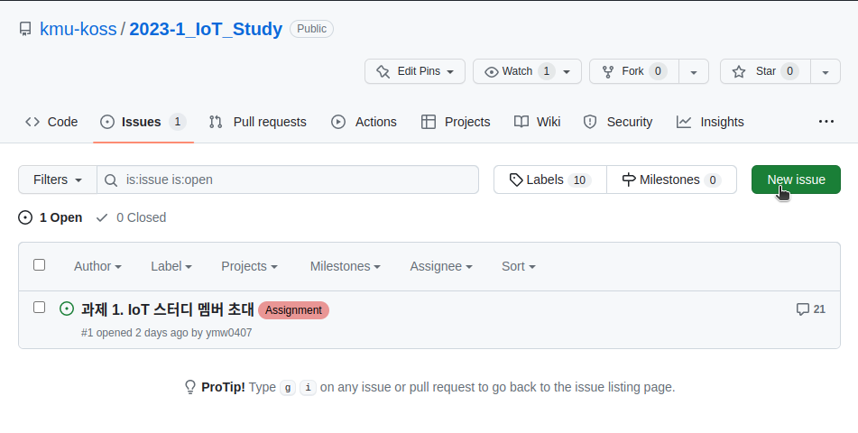
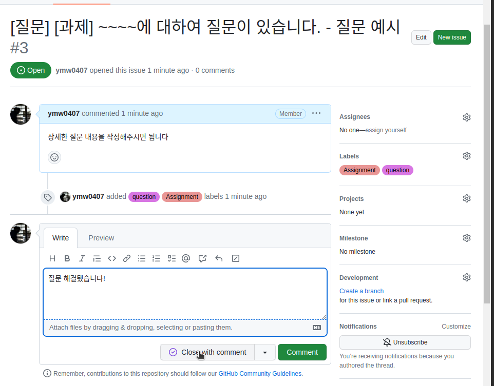

# KOSS 2023학년도 1학기 IoT 스터디
국민대학교 소프트웨어융합대학 OpenSource Software 학술동아리 KOSS의 2023학년도 1학기 IoT 스터디입니다.

## 스터디 진도
스터디는 4월 4일부터 1학기 동안 진행됩니다. <br>
스터디는 멘토들의 수업을 통해서 이뤄질 예정입니다.

### 1주차
- 날짜 : 2023-04-04 18:30 ~ 21:00
- 장소 : 국민대학교 미래관 445호
- 주제 : `1. Server - JavaScript에 대한 이해`
- 강의 자료 : <a href="./week1"> 링크 </a>

### 2주차
- 날짜 : 2023-04-06 18:30 ~ 21:00
- 장소 : 국민대학교 미래관 445호
- 주제 : `1. Server - Node.js 입문`
- 강의 자료 : <a href="./week2-1"> 링크 </a>

## 모각코 진도
모각코에서는 모각코 조끼리 모여서 자료들을 보면서 공부하며, 과제를 수행하는 방식으로 스터디와 함께 병행됩니다.

### 1주차
- 각자 조끼리 만나서 모각코 미션을 수행(친해지는 시간)

### 2주차
- 날짜 : 2023-04-06 18:30 ~ 21:00
- 장소 : 국민대학교 미래관 445호
- 주제 : `1. Server - Node.js와 EXPRESS.JS 입문`
- 강의 자료 : <a href="./week2-1"> 링크 </a>
- 과제 제출 : <a href="https://github.com/kmu-koss/2023-1_IoT_Study/issues/4"> 링크 </a> 

## 과제 제출 - GitHub

### 과제 제출 방법
과제를 제출할 때에는 다음과 같이 제출합니다.
1. 해당 Repository를 Fork합니다.


2. 과제를 완성하고, 자신의 모각코 조의 Branch에 Pull Requset를 건다.


3. 단, Pull Request를 걸때, #1과 같이 과제 번호와 연결한다.


---

### 온라인 질문 방법
스터디 시간 이외에 하고 싶은 질문이 있다면 Issue를 통하여 질문을 올려주시면 됩니다! <br>
그리고 이런 방법을 사용하는 이유는 OpenSource Software에 기여할 때나 프로젝트를 진행할때 GitHub를 사용할텐데, GitHub의 기능을 좀 더 원활하게 하기 위함입니다.

### GitHub Issue 질문 포맷
1. 해당 Repository의 <a href="https://github.com/kmu-koss/2023-1_IoT_Study/issues">Issues 카테고리</a>에서 New Issue 버튼을 누른다.<br>


2. 제목은 `[질문][과제] Express와 MongoDB를 연결하는 부분에 대해서 질문이 있습니다.`와 같은 포맷을 사용하여 올려주세요!

3. Write에는 보다 상세하게 어떤 부분에 문제가 있고, 어떤게 궁금한지 남겨주세요!

4. 아래의 사진과 같이 Labels에 question와 Assginment(과제에 대한 질문이라면.)를 추가하여 올려주세요!<br>


5. 그 이후에 멘토가 확인하고 해당 이슈에 comment를 달아드립니다.

6. 만약 문제가 해결됐으면, `질문 해결됐습니다`와 같은 comment와 함께 close with comment 버튼을 눌러주시면 됩니다.<br>


## mosquitto 설정

### 라즈베리파이(우분투) 환경에서 mosquitto 설치
1. 시스템 업데이트
```
$ sudo apt-get upgrade
$ sudo apt-get update
```
2. 모스키토 설치
```
$ sudo apt-get install mosquitto
$ sudo apt-get install mosquitto-clients
```
3. 설정파일 수정
```
sudo vi /etc/mosquitto/mosquitto.conf
```
```
# Place your local configuration in /etc/mosquitto/conf.d/

#

# A full description of the configuration file is at

# /usr/share/doc/mosquitto/examples/mosquitto.conf.example

pid_file /var/run/mosquitto.pid

persistence true

persistence_location /var/lib/mosquitto/

log_dest topic

log_type error

log_type warning

log_type notice

log_type information

connection_messages true

log_timestamp true

include_dir /etc/mosquitto/conf.d
```
4. 서버동작 시작
```
sudo /etc/init.d/mosquitto start
```
5. 두개의 터미널로 통신 테스트
```
mosquitto_sub -d -t hello/world
mosquitto_pub -d -t hello/world -m "Hello from Terminal window 2!"
```
위처럼 테스트를 해보고 mosquitto 서버 부분(-h 옵션 사용)에 라즈베리파이 ip주소를 적어주시면 통신이 됩니다.

### 맥 환경에서 mosquitto 설치
모스키토 설치
```
$ brew install mosquitto
```
모스키토 서비스 실행
```
$ brew services start mosquitto
```
모스키토 서비스 중지
```
$ brew services stop mosquitto
```
비서비스 실행
```
$ /usr/local/sbin/mosquitto -c /usr/local/etc/mosquitto/mosquitto.conf
```
