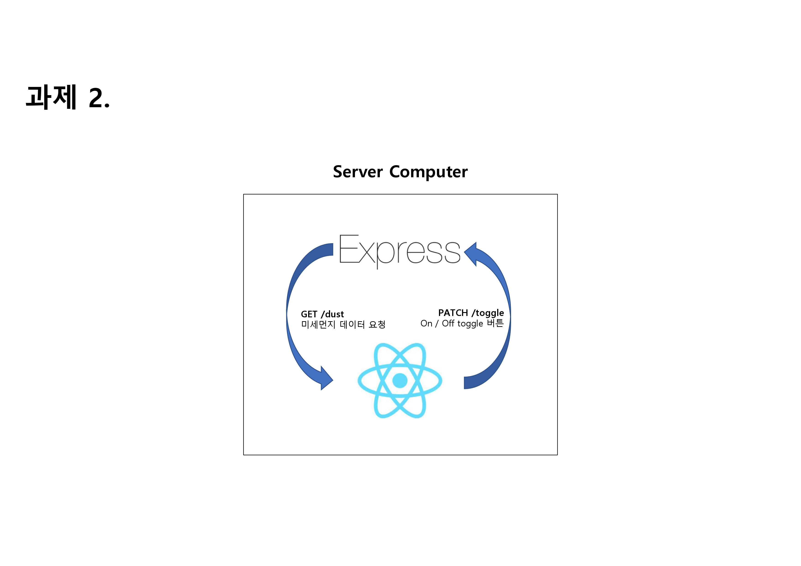
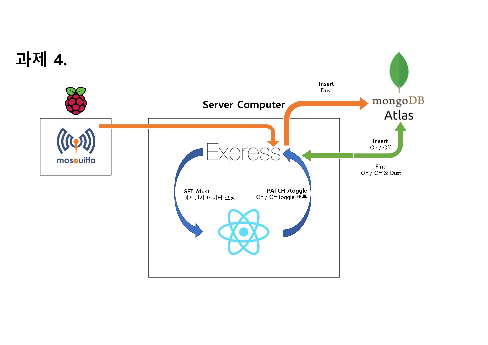

# 2주차 IoT 스터디
## 개요
주차: 2주차 스터디 <br>
날짜: 2023년 4월 11일 화요일 18:30 ~ 21:00 <br>
장소: 국민대학교 미래관 445호 <br>
주제: `2. Embedded System - Raspberry Pi & MQTT Protocol` <br>
참여: IoT 스터디 및 CV 스터디 참여자 22명 <br>
멘토: 윤민우, 이준혁, 윤신지 <br>

## 진행 방식
1. 모각코 조끼리 모입니다.
2. 멘토가 진행하는 수업을 듣고, 제공된 과제를 같이 수행합니다.
3. 만약 질문이 있다면, 멘토를 불러주세요! 만약, 멘토가 없다면 <a href="https://github.com/kmu-koss/2023-1_IoT_Study#%EC%98%A8%EB%9D%BC%EC%9D%B8-%EC%A7%88%EB%AC%B8-%EB%B0%A9%EB%B2%95">온라인 질문 방법</a>을 참고하여 GitHub Issue를 통해 질문해주세요!
4. <a href="https://github.com/kmu-koss/2023-1_IoT_Study#%EA%B3%BC%EC%A0%9C-%EC%A0%9C%EC%B6%9C---github">과제 제출 포맷</a>을 참고하여 과제를 각자 제출합니다.

## 준비물
- `Raspberry Pi 4` or `Raspberry Pi 3 + 랜선 + 허브`

## 강의 자료

이번 시간에는 Raspberry Pi를 사용해보는 시간을 가져볼 것입니다. <br>
아래에 있는 사진은 우리가 오늘까지 제출했던 과제 2의 System Architecture입니다. <br><br>
 <br>
과제 2에서는 Express를 사용하여 Web Server를 구현하고, React와 연동하여 데이터를 주고 받는 것을 해보았습니다. <br><br>
그리고 미리 고지해드린 다음 과제, 과제 3의 System Architecture를 본다면 다음과 같습니다. <br>
 <br>
과제 3에서는 MongoDB를 추가하여 데이터를 Insert하고, Insert한 데이터를 Find하여 가져와서 React의 표기하는 과제를 진행해보았습니다.<br><br>
이번에는 Raspberry Pi에 MQTT Broker를 사용하여 다음과 같은 System Architecture와 같이 구현하여 MQTT 서버로 데이터를 보내고, 받아서 MongoDB에 Insert하고, 그렇게 Insert된 데이터를 UI에서 가져오도록 만들어보겠습니다.

<br><br>

### Raspberry Pi 설정
아마 소프트웨어프로젝트1 강의 시간에 다들 라즈베리파이를 다뤄보셨을 겁니다. <br>
혹시나! 기억이 안나시는 분들이나, 아직 강의 시간에 배워보지 못하신 분들을 위해서 Raspbin OS 설치부터 설정까지 다뤄보도록 하겠습니다.<br><br>
1. Raspbian OS Image 설치<br>
    우선 <a href="https://www.raspberrypi.com/software/operating-systems/">Raspbian OS 설치 페이지</a>에서 **Raspberry Pi OS (64-bit)** 에서 **Raspberry Pi OS with desktop**을 설치합니다. <br>
2. 이미지 플래싱을 위한 앱을 설치합니다.<br>
    자신의 OS에 맞는 <a href="https://www.balena.io/etcher"> Balena Etcher</a>를 설치해줍니다. 만약에, 다른 앱을 사용해서 이미지 플래싱을 할 수 있다면, 안하셔도 좋습니다.
3. MicroSD Card를 컴퓨터에 연결하고 MicroSD Card에 무언가가 있다면 포맷을 진행한 이후에, Balena Etcher를 사용하여 설치한 이미지를 MicroSD Card에 Flashing을 진행합니다.
4. MicroSD Card를 Raspberry Pi에 꼽고, 전원을 연결합니다.
5. Raspberry Pi와 모니터를 연결하여 초기 설정을 진행한 이후, 와이파이와 연결합니다.
<br><br>

이렇게 간단하게 세팅을 마쳤는데 모니터를 통해서 알 수 있다시피 라즈베리파이는 성능이 좋지 않은 하나의 작은 컴퓨터입니다. 우리는 이런 작은 컴퓨터에 MQTT Broker Server를 설치하여 사용할 것입니다.

### MQTT란
MQTT(Message Queueing Telemetry Transport)는 2016년 국제 표준화 된 (ISO 표준 ISO/IEC PRF 20922) 발행-구독(Publish-Subscribe) 기반의 메시지 송수신 프로토콜입니다. <br><br>
우리가 이전에는 Express로 REST API를 사용하여 통신을 진행해보았는데, 우리가 REST API를 사용하여 간단하게 데이터를 보내기 위해선 HTTP Request와 Response를 사용하게 되는데, 다음의 예시를 봅시다.
```HTTP
GET /dust HTTP/1.1
Host: example.com
Accept: application/json

----------------------------------------------------------------------
HTTP/1.1 200 OK
Content-Type: application/json; charset=UTF-8
Content-Length: 29

{"team" : "모각코 7조", "value": 48}
```
위와 같이 한 개의 데이터를 받아오기 위해 많은, 필요 없는 과정을 거치게 됩니다. 그렇기 때문에 Arduino와 같은 MCU(Micro Controller Unit)을 사용하게 되면, 많은 자원 소모와 딜레이를 유발할 것입니다. <br><br>
그렇기 때문에 IoT에서는 더 작은 데이터 패킷을 주고 받고, 경량화된 프로토콜인 MQTT를 사용하여 많은 통신을 진행하게 됩니다. <br><br>

<br>
위의 이미지에서 알 수 있듯이 MQTT는 Subscribe(구독)과 Publish(발행)의 구조로 이루어져 있습니다. <br><br>
여기서 중요한 것은 MQTT Broker가 가운데에 있다는 건데, 우리는 이제 이 Broker 서버를 Raspberry Pi에 설치하고, Broker에 연결하여 Express 서버가 MQTT Broker와 연결하여 특정 Topic을 Subscribe하고 외부 서버(노트북) 또한 Broker와 연결을 진행한 후, 특정 Topic에 Publish를 하는 과정을 보여드릴 것입니다.

### mosquitto 설정
- 라즈베리파이(우분투) 환경에서 mosquitto 설치
    1. 시스템 업데이트
        ```
            $ sudo apt-get upgrade
            $ sudo apt-get update
        ```
    2. 모스키토 설치
        ```
        $ sudo apt-get install mosquitto
        $ sudo apt-get install mosquitto-clients
        ```
    3. 설정파일 수정
        ```
        sudo vi /etc/mosquitto/mosquitto.conf
        ```
        ```
        # Place your local configuration in /etc/mosquitto/conf.d/

        #

        # A full description of the configuration file is at

        # /usr/share/doc/mosquitto/examples/mosquitto.conf.example

        pid_file /var/run/mosquitto.pid

        persistence true

        persistence_location /var/lib/mosquitto/

        log_dest topic

        log_type error

        log_type warning

        log_type notice

        log_type information

        connection_messages true

        log_timestamp true

        include_dir /etc/mosquitto/conf.d
        ```
    4. 서버동작 시작
        ```
        sudo /etc/init.d/mosquitto start
        ```
    5. 두개의 터미널로 통신 테스트
        ```
        mosquitto_sub -d -t hello/world
        mosquitto_pub -d -t hello/world -m "Hello from Terminal window 2!"
        ```
        위처럼 테스트를 해보고 mosquitto 서버 부분(-h 옵션 사용)에 라즈베리파이 ip주소를 적어주시면 통신이 됩니다.

### 맥 환경에서 mosquitto 설치
- 모스키토 설치
    ```
    $ brew install mosquitto
    ```
- 모스키토 서비스 실행
    ```
    $ brew services start mosquitto
    ```
- 모스키토 서비스 중지
    ```
    $ brew services stop mosquitto
    ```
- 서비스 실행
    ```
    $ /usr/local/sbin/mosquitto -c /usr/local/etc/mosquitto/mosquitto.conf
    ```

## 과제(~4/13)
해당 과제도 모각코 조와 함께하는 과제로 13일까지 제출해주세요. <br>
이전 과제에서는 `[{ team: "모각코 7조", value: "28" }, { team: "모각코 2조", value: "38" }]`을 하드 코딩을 통해서 저장했었는데, 이번엔 MongoDB(혹은 MongoDB Atlas)와 Mongoose를 Express 서버에 추가하여 데이터베이스에 있는 정보들을 find하여 미세먼지 정보를 가져오고, 그 정보를 GET Method가 동작할때 보낼 수 있도록 만들어보세요! <br>
그리고 Mongoose를 사용할때 민감한 정보(아이디, 비밀번호)가 포함되기 때문에, GitHub에 절대 올리지 마시고 dotenv 모듈을 공부하여 dotenv를 통해서 민감한 데이터가 공개되지 않게 만드세요! <br>
아래의 System Architecture를 참고하여 만들어주세요! 


<br><br>

## 미리 보는 과제(~4/18)
Raspberry Pi에 MQTT Broker를 올리고, MQTT Broker에다가 `/dust` Topic에 `{ team: "모각코 7조", value: 48 }`를 보내면 Express에서 해당 데이터를 받아서, MongoDB에 데이터를 Insert 하게 구현해주시면 됩니다!<br>

아래의 System Architecture를 참고하여 만들어주세요! 

